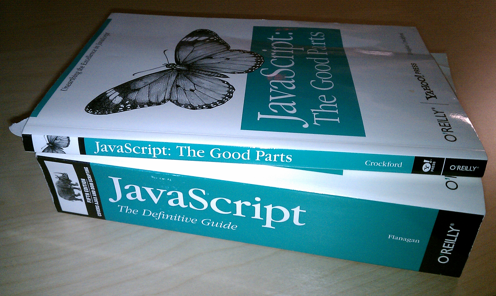

## 這週學了一大堆以前搞不懂的東西，你有變得更懂了嗎？請寫下你的心得。

賦值操作的時候，只要知道資料是不是 mutable 就可以正確操作它們。
let, const 使用 block 作用域，讓變數的作用範圍更符合我們期望的樣子。
hoisting 的效果可以在變數或函數宣告之前被使用，雖然是方便功能，但感覺不是寫程式的好習慣。
closure 保護內部資料，封裝更徹底。
prototype、class 風格不統一的物件導向做成的撒尿牛丸，function constructor，我揪竟在寫 fucntion 還是在寫 object？
this 是物件導向的產物，使用前請詳閱公開說明書
this 是物件導向的產物，使用前請詳閱公開說明書
this 是物件導向的產物，使用前請詳閱公開說明書

[source](https://www.flickr.com/photos/nathansmith/4704268314)
希望我只要學會 JS 好的部份就可以了 XD
